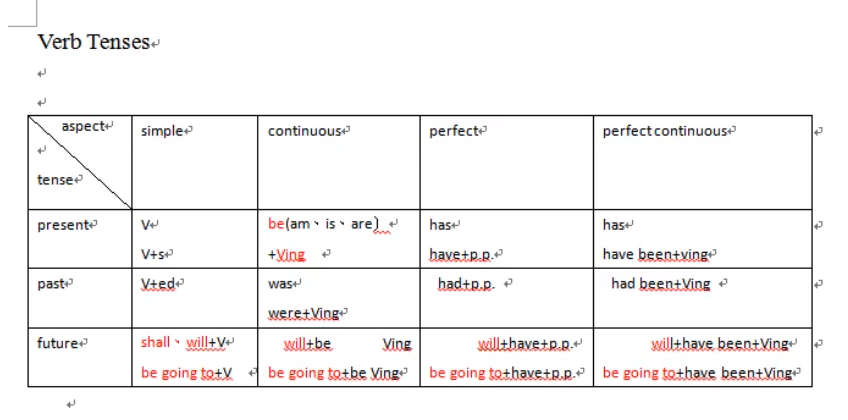
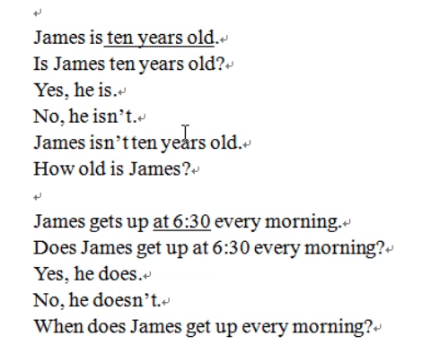
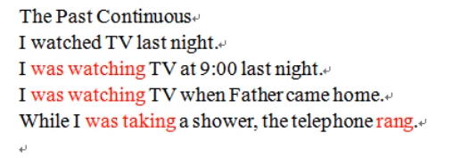

# Understanding and Using English Grammar

### Sentence

1. S+V Henry works in the post office.
2. S+LinkingV+C Robert is cute.
3. S+V+O People\(all over the world\) study English.
4. S+V+I.O.+D.O.  \(Indirect Object, Direct Object\): The man showed me his ID card.  The man showed his ID card to me.
5. S+V+O+C\(補語:補充說明\) 

### Verb Tenses

### 否定及問句

### 

### 

### 

