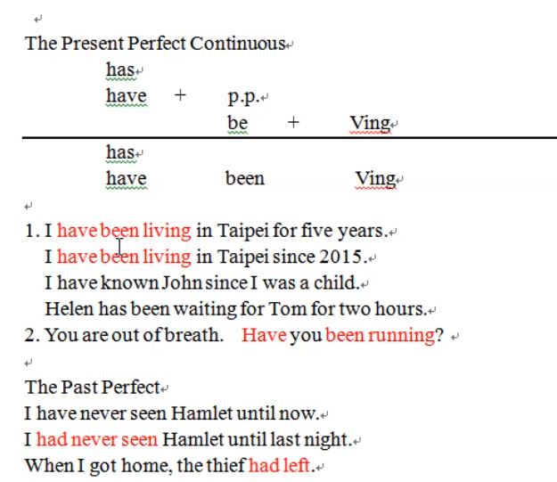

# Present Perfect Continuous

### Purpose

1. 完成進行式表示持續沒有間斷 \(與完成式持續一段時間可互相替換\) John has studied English for years age. John has been studying English for years ago.
2. 說話前持續進行一陣子的動作


wait, sit, rain 這類動作開始就不間斷

known 沒有動作所以沒有完成進行式


