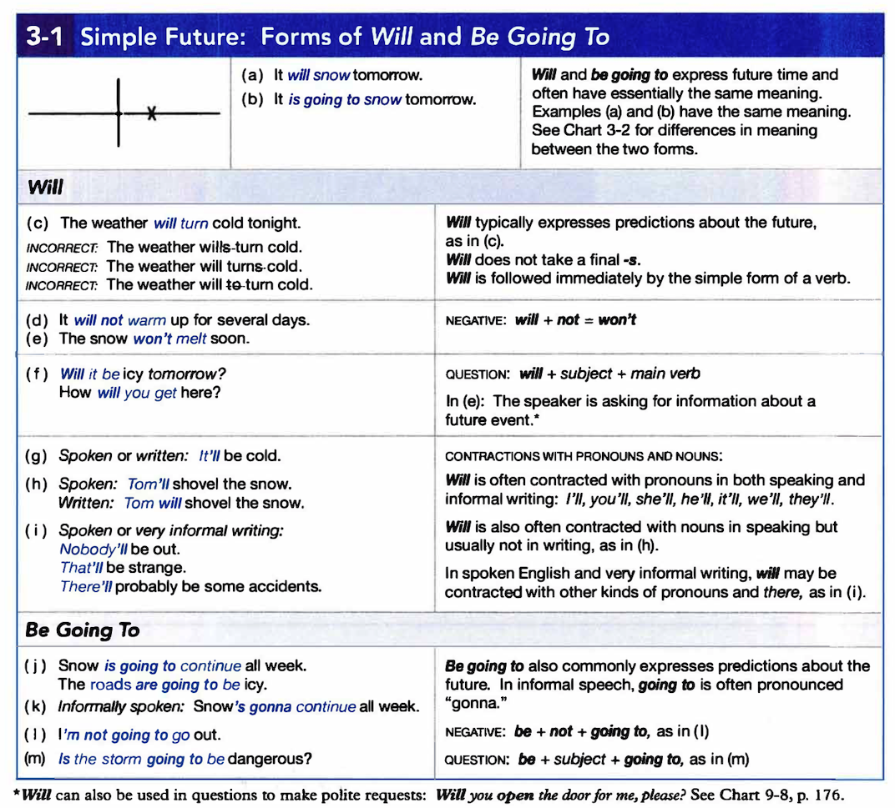
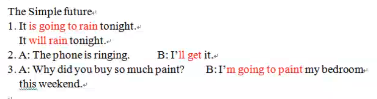

# Simple Future

### Purpose

1. 對未來做預測 will / be going to
2. 牽涉到意願的話,使用 will
3. 事先計劃好的,使用 be going to, 利用進行式代替未來
4. 當牽涉到時間副詞子句,可用現在簡單代替未來


**should** 用在疑問句,並且主詞是 I, We 表示徵求對方同意


B: I am painting my bedroom this weekend


**Simple Present Progressive** 可以代替未來, 用來使用預定的事件, 通常會與時間單詞一起使用



**Simple Present** 可以代替未來,同樣也是用在計畫好的的行程,通常用在這一類的動詞:

`open, close, begin, end, start, finish, arrive, leave, come, return`


